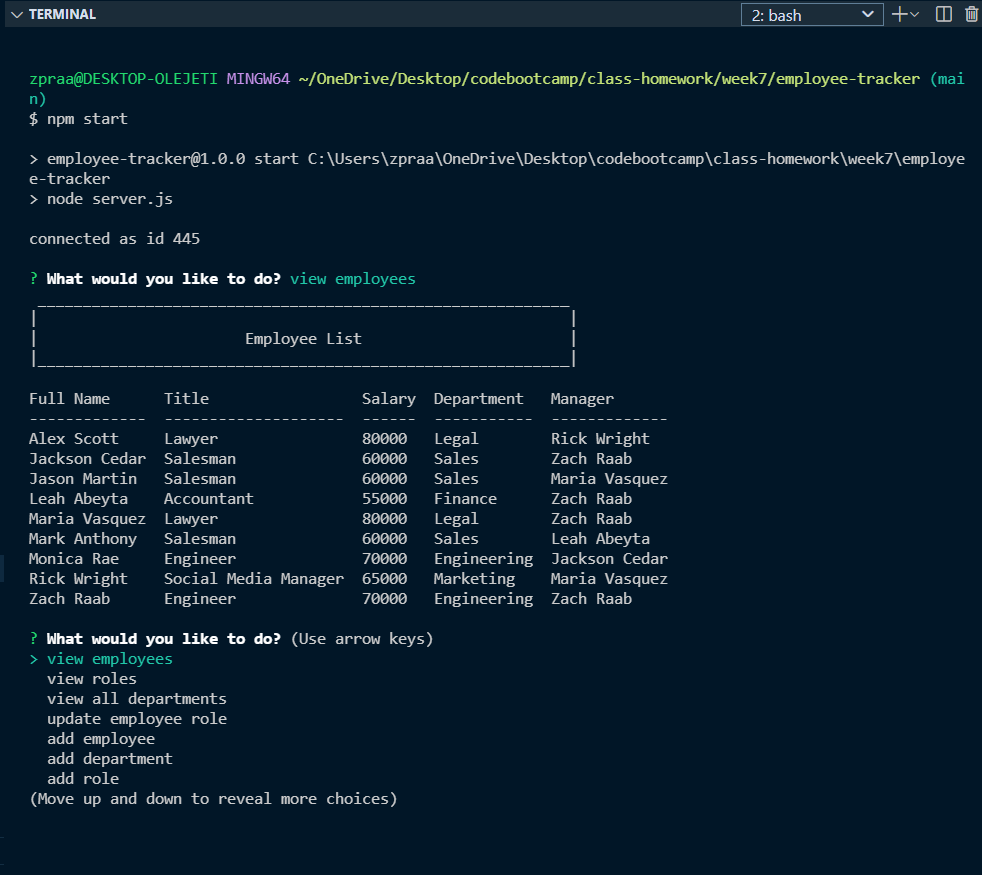

# employee-tracker

## Description

This is a back-end, command-line application that makes it easy to manage a company's employee's using node, inquirer, and MySQL. The user is able to CREATE, READ, and UPDATE the company's database.

## Table of Contents

- [Installation Instructions](#Installation-Instructions)
- [Usage Information](#Usage-Information)
- [Links](#links)

## Installation Instructions

Install NodeJS [HERE](https://nodejs.org/en/). Install MySQL Workbench and Shell for the application database [HERE](https://dev.mysql.com/downloads/windows/installer/8.0.html) and [HERE](https://dev.mysql.com/downloads/shell/). Open your terminal and navigate to the root level directory. Run `npm i` to install all necessary node packages. Copy and paste the schema.sql from the root directory into your MySQL workbench and run the code in order to generate the necessary tables for the database.

## Usage Information

Open your terminal and navigate to the root level directory of the application. Run `npm start` or `node server.js` to start the application. Follow the prompted questions in the terminal. Select `Exit Prompt` when you have completed managing your company.

## Links
 
[GitHub](https://github.com/zachraab/employee-tracker)  
[Video Walkthrough](https://youtu.be/kQbrnfSvMsU)
